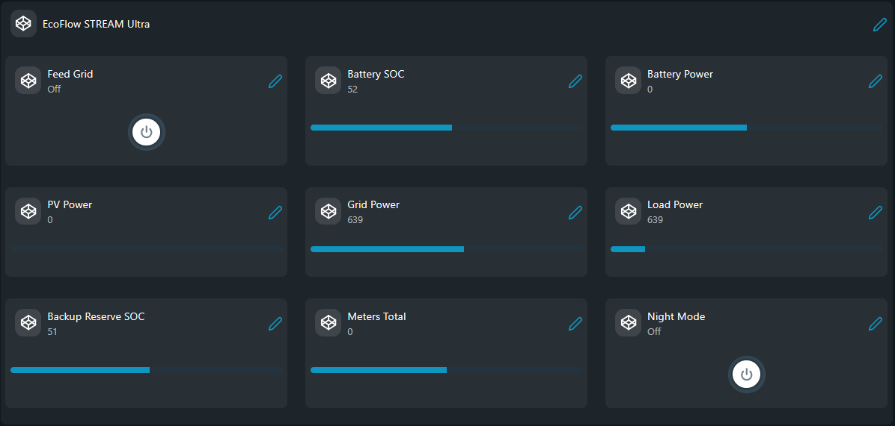

# EcoFlow STREAM Ultra — Load Balancing (Static Config)

Controls an EcoFlow STREAM Ultra battery via the EcoFlow cloud API based on aggregated readings from Shelly EM / Plug S devices on the local network.

## Problem (The Story)
A home energy setup with a STREAM Ultra battery needs to automatically switch between discharge (self-consumption), night charging, and idle modes based on real-time total load — without any cloud dashboards or vendor apps making the decision. This script polls local Shelly meters, computes the aggregate load, and drives the STREAM Ultra through the EcoFlow REST API directly from the Shelly device.

## Persona
- Home solar / storage enthusiast maximising self-consumption
- Energy automation engineer integrating battery dispatch into local logic
- Installer commissioning a STREAM Ultra alongside Shelly metering

## Files

| File | Status | Description |
|------|--------|-------------|
| [`load_balancing_static_vc.shelly.js`](load_balancing_static_vc.shelly.js) | production | Creates Shelly Virtual Components, polls Shelly meters, and dispatches charge / discharge / idle commands to the STREAM Ultra. |
| [`load_balancing_static.shelly.js`](load_balancing_static.shelly.js) | under development | Console/static-config variant without the production VC dashboard flow. |

## Modes

| Mode        | Condition                                      | Action                                      |
|-------------|------------------------------------------------|---------------------------------------------|
| `discharge` | total load > `threshold` W during day hours    | Battery feeds grid / loads (self-powered)   |
| `charge`    | current hour is within night window            | Battery charges to `nightSoc` %             |
| `idle`      | day hours + load ≤ `threshold` W               | Battery holds current SOC, no feed-in       |

## Configuration

Edit `CONFIG` and `DEVICES_CFG` directly in the script before uploading — no KVS required.

### CONFIG

| Key          | Default | Description                                           |
|--------------|---------|-------------------------------------------------------|
| `accessKey`  | —       | EcoFlow API access key                                |
| `secretKey`  | —       | EcoFlow API secret key                                |
| `serial`     | —       | STREAM Ultra device serial number                     |
| `region`     | `"eu"`  | API region: `"eu"` or `"us"`                          |
| `nightStart` | `23`    | Hour (0–23) when night charging begins (inclusive)    |
| `nightEnd`   | `6`     | Hour (0–23) when night charging ends (exclusive)      |
| `nightSoc`   | `95`    | Backup-reserve % to target during night charging      |
| `threshold`  | `600`   | W — total load above this triggers discharge mode     |
| `pollMs`     | `5000`  | Polling interval in milliseconds                      |

### DEVICES_CFG

List the Shelly meters to aggregate:

```js
var DEVICES_CFG = [
    { type: "em",   host: "192.168.1.10", channel: 0, name: "Main EM ch0" },
    { type: "em",   host: "192.168.1.10", channel: 1, name: "Main EM ch1" },
    { type: "plug", host: "192.168.1.20", channel: 0, name: "Plug South"  }
];
```

| Field     | Values          | Description                                  |
|-----------|-----------------|----------------------------------------------|
| `type`    | `"em"`, `"plug"`| `"em"` = Shelly EM Gen4; `"plug"` = Plug S Gen3 |
| `host`    | IP / hostname   | Address of the Shelly device                 |
| `channel` | `0`, `1`, …     | EM channel index or Switch id                |
| `name`    | any string      | Friendly label for log output                |

## EcoFlow API Credentials

1. Log in to the [EcoFlow developer portal](https://developer-eu.ecoflow.com) (EU) or [developer portal](https://developer.ecoflow.com) (US).
2. Create an app and copy the **Access Key** and **Secret Key**.
3. Find your STREAM Ultra **serial number** in the EcoFlow app under device settings.
4. Fill in `CONFIG.accessKey`, `CONFIG.secretKey`, and `CONFIG.serial`.

## Screenshot
This screenshot shows the EcoFlow STREAM Ultra Virtual Components group in the Shelly app with Battery SOC, Battery Power, PV Power, Grid Power, Load Power, Backup Reserve SOC, Meters Total, Feed Grid, and Night Mode updating in real time.



## References
- [EcoFlow Open Platform (EU)](https://developer-eu.ecoflow.com)
- [EcoFlow Open Platform (US)](https://developer.ecoflow.com)
