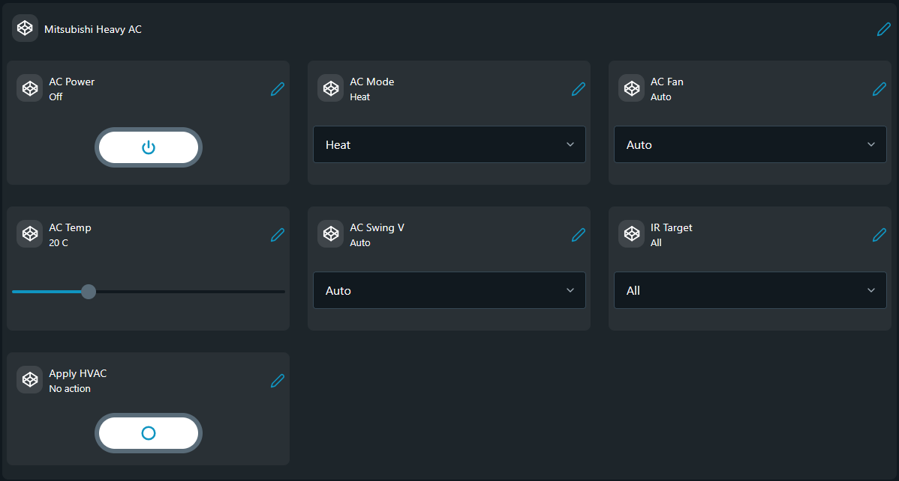

# Mitsubishi Heavy AC via Tasmota IR Bridge

Controls a Mitsubishi Heavy air conditioner from a Shelly device by sending
HTTP `IRHVAC` commands to one or more Tasmota IR bridges on the local network.

## Problem (The Story)
You want a Shelly-native control surface for an air conditioner, but the actual
IR hardware in the installation is a Tasmota-based IR blaster. Rather than
moving the whole automation into Tasmota, this script keeps the control logic
and user interaction on Shelly and uses Tasmota only as the endpoint that
transmits the infrared command.

## Persona
- Home automation user who wants one Shelly dashboard to control HVAC state
- Integrator bridging Shelly Virtual Components to Tasmota IR hardware
- Installer standardising control logic on Shelly while reusing existing IR bridges

## Files

| File | Status | Description |
|------|--------|-------------|
| [`mitsubishi_heavy_ac_vc.shelly.js`](mitsubishi_heavy_ac_vc.shelly.js) | production | Creates Virtual Components and sends `IRHVAC` commands to the selected Tasmota target. |

## How Shelly and Tasmota Work Together

1. The Shelly script creates a Virtual Components control panel.
2. A user changes power, mode, fan, temperature, swing, and target in the Shelly app.
3. When `Apply HVAC` is pressed, Shelly builds an `IRHVAC` payload.
4. Shelly sends an HTTP request to the selected Tasmota endpoint.
5. The Tasmota IR bridge emits the Mitsubishi Heavy IR frame toward the AC unit.

## Control Targets

The script defines named targets that map to Tasmota endpoints:

```js
var IR_TARGETS = ['Zone 1', 'Zone 2', 'All'];
```

`All` is a fan-out option. It is not its own endpoint; it sends the same IR
command to both configured Tasmota devices.

## Endpoint Configuration

Edit the target map in the script before uploading:

```js
var IR_TARGET_IPS = {
  'Zone 1': '192.0.2.10',
  'Zone 2': '192.0.2.11',
};
```

These addresses are placeholder examples. Replace them with the real LAN IPs or
hostnames of your Tasmota IR devices.

## Virtual Components Created

- `group:208` Mitsubishi Heavy AC
- `boolean:200` AC Power
- `enum:202` AC Mode
- `enum:203` AC Fan
- `number:204` AC Temp
- `enum:205` AC Swing V
- `button:206` Apply HVAC
- `enum:209` IR Target

## Screenshot

This screenshot shows the Mitsubishi Heavy AC Virtual Components group in the
Shelly app with power, mode, fan, temperature, swing, and target controls ready
to send through the Tasmota IR bridge.



## Tasmota Requirements

- The Tasmota endpoint must be reachable from the Shelly device.
- The Tasmota device must expose `/cm?cmnd=`.
- The device must support the `IRHVAC` command and the
  `MITSUBISHI_HEAVY_88` vendor profile used by the script.

## Request Shape

Shelly sends requests in this form:

```text
http://<tasmota-ip>/cm?cmnd=IRHVAC%20{...json...}
```

That means the Shelly device is responsible for state assembly and HTTP
transport, while Tasmota is responsible for IR transmission only.
