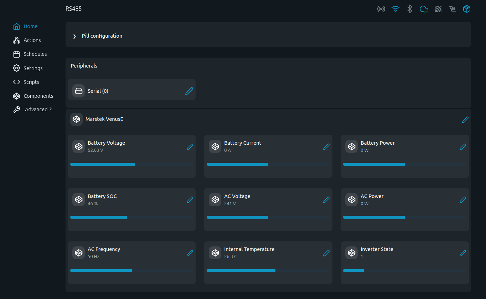

# Marstek VenusE MODBUS Examples

Read-only MODBUS-RTU telemetry for a Marstek VenusE device using The Pill and its RS485 add-on.

## Problem (The Story)
A VenusE energy storage device exposes useful local telemetry over RS485, including battery voltage/current/power, SOC, AC power, daily energy, temperatures, inverter state, alarm, and fault words. These scripts provide a Shelly-side reader so the data can be validated locally before any control automation is added.

## Persona
- Installer commissioning a VenusE battery/inverter system
- Integrator exposing VenusE telemetry to Shelly Virtual Components
- Developer validating the vendor MODBUS map before writing controls

## Screenshot



This screenshot shows `venus_e_vc.shelly.js` running on The Pill with the
Marstek VenusE connected over RS485. The Shelly UI displays the grouped live
Virtual Components for battery voltage, current, power, SOC, AC voltage, AC
power, AC frequency, internal temperature, and inverter state.

## Files
- [`venus_e.shelly.js`](venus_e.shelly.js): console telemetry reader for key live/status registers
- [`venus_e_vc.shelly.js`](venus_e_vc.shelly.js): telemetry reader that creates and updates Shelly Virtual Components with label-backed UI ranges
- [`screenshot.png`](screenshot.png): Shelly UI screenshot of the Virtual Components view
- [`registers.md`](registers.md): cleaned register reference derived from the Marstek CSV
- [`modbus marstek - address.csv`](modbus%20marstek%20-%20address.csv): original source register map
- [`modbus marstek - ex_info.csv`](modbus%20marstek%20-%20ex_info.csv): alarm and fault bit definitions
- [`label.md`](label.md): device identity and missing label details
- [`TODO.md`](TODO.md): remaining validation and implementation tasks

## Status
These files are marked `under development` until the following are confirmed on hardware:
- 32-bit word order
- signed values for current and power
- alarm/fault bit behavior on real hardware
- whether the device accepts FC06/FC10 writes safely

## Protocol Source
Protocol information from the Venus-E 3.0 485 protocol notes:

| Field | Value |
|---|---|
| Protocol | Standard Modbus RTU Protocol |
| Default MODBUS address | `1` |
| Serial settings | `115200`, 8 data bits, no parity, 1 stop bit |
| Version | `v1.0` |
| Date | `2024-07-08` |
| Change note | first version |

## Communication
Documented defaults in both scripts:

| Parameter | Value |
|---|---|
| Function code | `0x03` Read Holding Registers |
| Slave ID | `1` |
| Baud rate | `115200` |
| Mode | `8N1` |
| Register address base | direct decimal addresses from the CSV |

The device has been verified to respond with these settings on The Pill.
Both `venus_e.shelly.js` and `venus_e_vc.shelly.js` have been tested on the
target device and successfully read live MODBUS values.

## RS485 Wiring (The Pill 5-Terminal Add-on)

Marstek Venus-E 3.0 RS485 RJ45 pinout, looking into the device socket with the
clip/latch orientation matching a normal RJ45 numbering reference:

| RJ45 pin | Function | Connect to The Pill |
|---:|---|---|
| 1 | RS485 B | `B` |
| 2 | RS485 A | `A` |
| 3 | Not documented | leave open |
| 4 | +5 V | leave open |
| 5 | +5 V | leave open |
| 6 | Not documented | leave open |
| 7 | GND | `GND` recommended |
| 8 | GND | `GND` recommended |

Do not connect the Venus-E `+5 V` pins to The Pill unless you intentionally
need that supply for an isolated adapter and have verified the current limits.
If the bus is silent, swap only `A` and `B`; do not experiment with the `+5 V`
pins.

This RJ45 pinout has been confirmed for the device used in this integration.
Keep this section as the connector reference for future wiring diagrams and
field notes.

```
                        |=============|              |==============|
                   /====|         VCC |              |              |
                   |    | GND     GND |              | SLAVE DEVICE |
/========\         |    | TX      +5V |              |              |
|The Pill|-----=||||    | RX        A |------\/------| A            |
\========/         |    | RE/DE     B |------/\------| B            |
                   |    | +5V       A |              |              |
                   \====|           B |              |              |
                        |=============|              |==============|
```

## Virtual Component Mapping
`venus_e_vc.shelly.js` creates these components automatically:

| VC ID | Name | Unit | UI range | Basis |
|---|---|---|---|---|
| `group:220` | Marstek VenusE | group | n/a | container |
| `number:220` | Battery Voltage | V | `0..100` | `51.2 V` nominal battery voltage |
| `number:221` | Battery Current | A | `-100..100` | `100 Ah` battery capacity; signed register |
| `number:222` | Battery Power | W | `-2500..2500` | `2500 W / 2500 VA` device rating; signed register |
| `number:223` | Battery SOC | % | `0..100` | percentage value |
| `number:224` | AC Voltage | V | `187..253` | label grid voltage range |
| `number:225` | AC Power | W | `-2500..2500` | `2500 W / 2500 VA` device rating; signed register |
| `number:226` | AC Frequency | Hz | `45..55` | `50 Hz` nominal grid frequency with validation headroom |
| `number:227` | Internal Temperature | C | `-10..55` | label operating ambient range |
| `number:228` | Inverter State | raw enum | `0..6` | documented state enum |

The Pill currently supports 10 Virtual Components total on the tested
firmware, so the VC script uses one group plus nine high-priority telemetry
numbers. Daily energy values remain available in the console reader
`venus_e.shelly.js`.

The power component ranges intentionally use `2500 W` instead of `5000 W`.
The label identifies this as a `MST-BIE5-2500` unit with `5120 Wh` battery
energy and `2500 W / 2500 VA` power ratings, so `5000` would describe battery
energy class rather than instantaneous inverter power.

## Notes
- The scripts intentionally do not write registers.
- Register `42000` appears to gate RS485 control mode for control registers `42000-42999`; this needs manual validation before any write script is added.
- Register `32202` says positive AC power means feed-in to the grid.
- Register `32204` is live-tested with `0.1 Hz` scaling on this device, despite the source CSV showing `0.01 Hz`.
- 32-bit word order is still open because the initial hardware test had no load and did not produce useful non-zero 32-bit power/energy values.
- Register `35100` currently maps `0=sleep`, `1=standby`, `2=charge`, `3=discharge`, `4=backup mode`, `5=OTA upgrade`, `6=bypass`.
- `venus_e.shelly.js` decodes active alarm/fault bit labels from `modbus marstek - ex_info.csv`.
- The RJ45 RS485 pinout has been confirmed on the device used for this integration.
