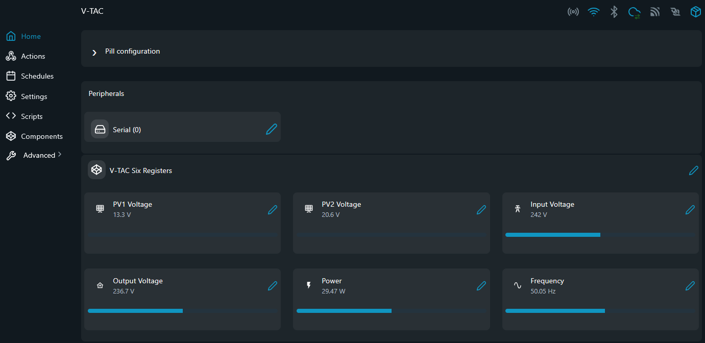

# V-TAC MODBUS Examples

RS485/MODBUS utilities and notes for the V-TAC `VT-66036103` hybrid inverter on The Pill.

## Problem (The Story)
This inverter documents RS485 connectivity, but its public manual does not include a usable register map. Before writing a dedicated reader, you need to confirm that the bus is live and discover readable registers from The Pill.

## Persona
- Integrator commissioning a V-TAC inverter onto a local energy system
- Installer validating the inverter RS485 port before larger automation work
- Developer trying to confirm whether the exposed interface behaves like Modbus RTU

## Files
- [`vtac_six_register_example.shelly.js`](vtac_six_register_example.shelly.js): compact example reader for the six strongest current live-register candidates
- [`vtac_six_register_example_vc.shelly.js`](vtac_six_register_example_vc.shelly.js): Virtual Components variant of the six-register example that creates six Number VCs and updates live values every 15 seconds
- [`vtac_baseline_watch.shelly.js`](vtac_baseline_watch.shelly.js): baseline watcher that polls all known readable holding and input registers and reports deviations from the saved defaults
- [`vtac_inferred_reader.shelly.js`](vtac_inferred_reader.shelly.js): console reader built from the current inferred register map
- [`registers.md`](registers.md): discovered holding and input registers captured as tables
- [`register-proposals.md`](register-proposals.md): inferred register naming, scaling, and grouping proposal based on public V-TAC/INVT data
- [`label.md`](label.md): extracted label information and document links for `VT-66036103`
- [`datasheets/`](datasheets/): collected vendor documents and mirrors
- [`../utils/modbus_register_scan.shelly.js`](../utils/modbus_register_scan.shelly.js): shared single-register discovery utility for `FC03` and `FC04`

## Screenshot



This screenshot shows the `vtac_six_register_example_vc.shelly.js` script running on The Pill with the V-TAC inverter connected over RS485. The six Virtual Components — PV1 Voltage (13.3 V), PV2 Voltage (20.6 V), Input Voltage (242 V), Output Voltage (236.7 V), Power (29.47 W), and Frequency (50.05 Hz) — update live every 15 seconds directly in the Shelly app.

## RS485 Wiring (The Pill 5-Terminal Add-on)

```
                        |=============|              |==============|
                   /====|         VCC |              |              |
                   |    | GND     GND |              | SLAVE DEVICE |
/========\         |    | TX      +5V |              |              |
|The Pill|-----=||||    | RX        A |------\/------| A            |
\========/         |    | RE/DE     B |------/\------| B            |
                   |    | +5V       A |              |              |
                   \====|           B |              |==============|
                        |=============|
```

## Notes
- The official manual confirms `RS485`, `CAN`, `WiFi`, `LAN`, and `DRM`.
- The public manual also exposes menu items for `485 Address` and `485 Baud rate`.
- This script no longer searches serial settings; it assumes you already know them and focuses only on discovering the register map.
- The register discovery scanner now lives under [`../utils/`](../utils/) because it is generic and not V-TAC-specific.
